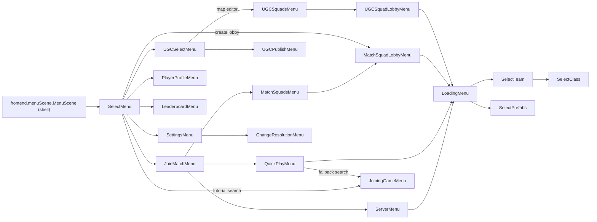

# Retail frontend screen and widget catalog

> **Recovery/specification reference.** Preserve the measured retail behavior and its evidence. Implementation updates, old build paths, test counts and session constraints below describe their original investigation; they are not current release or deployment status. Use the [maintained documentation index](../README.md) for present operating instructions and recheck historical findings against current source.

## Purpose and evidence boundary

This is the parity inventory for the native client's debug screen browser. It
describes the retail Python 2.7 frontend as recovered from
`G:\AoSRevival\aceofspades_decompiled`, not the current C++ approximation.
The machine-readable companion is
`assets/catalog/retail-frontend-screens.json`.

The primary evidence is the complete 57-class tree under
`aoslib/scenes/frontend`. Frontend-adjacent screens under
`aoslib/scenes/ingame_menus` are included when the frontend routes directly to
them or when they are part of the map-creator entry path. Widget definitions
come from `aoslib/gui.py`, `aoslib/scenes/gui`, and the list-row classes in
`aoslib/scenes/main`. Asset names are the exact `global_images` members used by
the recovered source. Coordinates use the retail 800 x 600, bottom-left-origin
canvas.

Reachability has three meanings:

- **reachable**: a visible retail control or normal callback enters it;
- **conditional**: requires service/session state, or exists behind a dormant
  callback;
- **component/helper**: not a standalone route and must not appear as if it
  were a complete screen.

The decompile is line-addressable evidence, but a few spelling mistakes are
retail spellings (`PlayListPanel`, `noof_visible_rows`, `STEMWORKS...`) and are
preserved where they identify code.

## Critical corrections for the parity browser

1. **Create Match is not a settings page.** `SelectMenu.squad_play_pressed()`
   creates a lobby and routes directly to `MatchSquadLobbyMenu`. The visible
   screen is a two-column lobby: player list/name/chat on the left, one of seven
   swappable panels on the right, and host/join/invite/team controls. Evidence:
   `selectMenu.py:251-296`, `baseSquadLobbyMenu.py:81-127, 153-221`, and
   `matchSquadLobbyMenu.py:8-38`.
2. **Player Profile is not a generic form.** It has four tabs (`PLAYER_STATS`,
   `GAME_MODES`, `CLASSES`, `EQUIPMENT`), a category/filter drop-down, specialized
   summary/stat rows, player name and K/D display, and Cancel/Achievements
   buttons. Evidence: `playerProfileMenu.py:111-164, 227-279, 365-406,
   438-555`.
3. **Map Editor is not the Loading screen.** The visible route is
   `UGCSelectMenu -> UGCSquadsMenu -> UGCSquadLobbyMenu`; only Start Game then
   enters `LoadingMenu`. Map-creator loading has `MAP` and `MODE` tabs but no
   `SCORES` tab. After loading it continues through the UGC selection flow.
   Evidence: `ugcSelectMenu.py:77-99`, `ugcSquadsMenu.py:23-78`,
   `ugcSquadLobbyMenu.py:8-45`, `loadingMenu.py:221-230, 451-480, 541-613`.
4. **Loading is a real tabbed screen.** It owns map art/preview, mode
   infographic, optional scores, custom-rules list, status/progress bar,
   password field, Back navigation and Start. It is not a reusable substitute
   for lobby/editor/profile layouts (`loadingMenu.py:39-142, 221-365`).
5. **The retail cursor is an image.** `run.py:396-399` loads `cursor`, creates
   `ImageMouseCursor(cursor_image, 6, cursor_image.height - 4)`, and installs it.
   The imported asset is `assets/original/png/ui/cursor.png` (64 x 64), so the
   exact retail hotspot arguments are `(6, 60)`.

## Reachable route graph



`CreditsMenu` has a real screen class and `SelectMenu.credits_pressed()`, but
the recovered main navigation bar is constructed without a right button. It is
therefore catalogued as **conditional/dormant**, not silently omitted.

## Standalone screen inventory

### Main and join routes

| Catalog ID / retail class | Route trigger | Controls and substates | Major retail assets | Evidence |
| --- | --- | --- | --- | --- |
| `select_menu` / `SelectMenu` | shell default | Text buttons: Join Match, Create Match, Player Profile, Map Creator. Square buttons: Tutorial, Achievements overlay, Leaderboard, Settings. Quit navigation action. Conditional DLC/full-game purchase panels and top-right player-name frame. | `main_image`, `main_menu_frame`, `name_frame`, `splash_image`, `main_menu_button_square*`, `tutorial_icon`, `achievements_icon`, `leaderboard_icon`, `options_icon`, `quit_icon`, `buy_game_background` | `selectMenu.py:22-112, 179-327` |
| `join_match` / `JoinMatchMenu` | Select: Join Match | Three stacked text buttons: Server Browser, Custom Match, Public Match; Back navigation. | `frame_3button_menu`, `frame_nav_bar_small`, `splash_image` | `joinMatchMenu.py:19-98` |
| `server_browser` / `ServerMenu` | Join: Server Browser | Sortable `ListGrid` columns Name/Players/Map/Mode/Ping; network source arrows; sources Internet All/Official/User, Favorites, History, Friends, Local; region tabs for Official; Full and Empty filters; Refresh, Favorite, selection-dependent Connect/Buy; map preview and server details; Back; double-click connects. | `large_frame`, `server_content_frame`, `server_tab_name_frame`, `left_arrow`, `right_arrow`, `favorite_star*`, `map_placeholder`, `map_previews` | `serverMenu.py:26-124, 144-263, 365-492` |
| `public_match` / `QuickPlayMenu` | Join: Public Match | Playlist table with Mode/Ping/Players columns; selectable playlist rows; right preview with mode letterbox, maps and rules; Refresh; Start Game or Buy Now; Back. | `large_frame`, `panel_frame`, `mode_images_letterbox`, `mode_image_letterbox_random`, `mode_image_letterbox_multi_mode` | `quickPlayMenu.py:24-76, 165-278` |
| `joining_game` / `JoiningGameMenu` | Tutorial; Public Match when no chosen server | Small search dialog; searching logo or tutorial art; status/error text; Cancel; conditionally enabled Start. Substates: searching, no servers, selected server. | `small_frame`, `searching_logo`, `searching_tutorial` | `joiningGameMenu.py:22-142, 217-237` |

### Create Match and lobby routes

| Catalog ID / retail class | Route trigger | Controls and substates | Major retail assets | Evidence |
| --- | --- | --- | --- | --- |
| `custom_match_list` / `MatchSquadsMenu` | Join: Custom Match | Lobby list, preview panel, Friends/Open source drop-down, Join Squad, conditional Buy; no separate Create button for this retail lobby type; Back. | `large_frame`, `panel_frame` | `baseSquadsMenu.py:26-92`, `matchSquadsMenu.py:12-66` |
| `create_match_lobby` / `MatchSquadLobbyMenu` | Select: Create Match after lobby creation; joined custom lobby | Left player list with editable squad title for host, invite, player/team counts, per-player team drop-down/kick, and squad chat/edit box. Right panel is one of Preview, Match Settings, Rules, Playlist, Maps, Prefab Sets, or UGC Mode. Bottom action changes among Start Game, Cancel, Confirm, Waiting/Join Game, Buy Now. | `large_frame`, `panel_frame`, `settings_matchsettings_frame`, `head_1`, `head_color_1`, `player_count_icon`, mode/map preview assets | `baseSquadLobbyMenu.py:45-221, 373-461, 689-833, 851-932`; `matchSquadLobbyMenu.py:8-38` |
| `create_match_lobby.preview` / `PreviewPanelBase` | non-host/default panel or Confirm return | Mode image/letterbox, expandable Game Info and Game Rules, DLC description/ownership states. | `panel_frame`, `mode_images_letterbox`, `mode_image_letterbox_random`, `mode_image_letterbox_multi_mode` | `previewPanelBase.py:21-214` |
| `create_match_lobby.settings` / `MatchSettingsPanel` | host initial panel; Edit Settings | Rows: Privacy, Mode/playlist, Max Players, Match Length, Map, Game Rules; optional Prefab Set, UGC Mode, UGC Map Title. Defaults action. Rows open the corresponding subpanel. | `settings_matchsettings_frame`, `panel_frame` | `matchSettingsPanel.py:22-261` |
| `create_match_lobby.rules` / `GameRulesPanel` | Match Settings: Game Rules | Expandable category rows; filter `SliderOption`; per-rule toggle or slider rows; Defaults. Availability changes with enabled classes/modes. | `settings_matchsettings_frame`, list/scroll/collapse assets | `gameRulesPanel.py:24-236` |
| `create_match_lobby.playlists` / `PlayListPanel` | Match Settings: Mode | Selectable playlist list titled Choose Game Mode; ownership state; selection rewrites mode/default rules and validates map. | `settings_matchsettings_frame`, list/scroll assets | `playlistPanel.py:16-144` |
| `create_match_lobby.maps` / `MapsPanel` | Match Settings: Map | Expandable map packs: Saved, Subscribed, standard/DLC packs, Templates; selectable ownable rows; Defaults/Select All behavior where enabled. | `settings_matchsettings_frame`, list/scroll/collapse assets | `mapsPanel.py:23-201` |
| `create_match_lobby.prefab_sets` / `PrefabSetsPanel` | Match Settings: Prefab Set | Selectable prefab-set rows populated from `A3056`. | `settings_matchsettings_frame`, list/scroll assets | `prefabSetsPanel.py:13-63` |
| `create_match_lobby.ugc_mode` / `UGCModePanel` | UGC lobby: Mode | Selectable UGC-compatible game modes; excludes tutorial, UGC and Classic CTF as separate rows; combines CTF/Classic CTF label. | `settings_matchsettings_frame`, list/scroll assets | `ugcModePanel.py:16-103` |

### Map Creator and Workshop routes

| Catalog ID / retail class | Route trigger | Controls and substates | Major retail assets | Evidence |
| --- | --- | --- | --- | --- |
| `ugc_select` / `UGCSelectMenu` | Select: Map Creator | Three stacked controls: Subscribe (Steam Workshop page), Publish Map, Map Editor; Back. | `frame_3button_menu`, `frame_nav_bar_small`, `splash_image` | `ugcSelectMenu.py:19-99` |
| `ugc_editor_lobbies` / `UGCSquadsMenu` | UGC Select: Map Editor | Available editor-lobby list, preview, Friends/Open drop-down, Join, New Lobby/Create, conditional Buy, Back. | `large_frame`, `panel_frame` | `baseSquadsMenu.py:26-283`, `ugcSquadsMenu.py:14-82` |
| `ugc_editor_lobby` / `UGCSquadLobbyMenu` | create/join editor lobby | Same two-column/player/chat composition as `BaseSquadLobbyMenu`, but settings rows are Privacy, Max Players, Map, UGC Mode, Prefab Set and editable UGC Map Title. Match Length, Game Rules and playlist selector are disabled. | `large_frame`, `panel_frame`, `settings_matchsettings_frame`, player/count assets | `ugcSquadLobbyMenu.py:8-45`, `baseSquadLobbyMenu.py:45-221` |
| `ugc_publish` / `UGCPublishMenu` | UGC Select: Publish Map | Initial split view: local Map List left and map publishability preview right with Delete. Preview Publish swaps left to Name Map edit/preview, then Publish confirmation. Includes Published Maps/overwrite state in the recovered panel set; Publish/Overwrite/Buy; Back; modal MessageBox states for license, uploading, errors and deletion. | `large_frame`, `panel_frame`, message-box frames | `ugcPublishMenu.py:23-267` |
| `ugc_publish.map_list` / `UGCMapsListPanel` | UGC Publish initial | Hosted UGC map rows with unpublished/data-required/published/changed state. | panel/list/scroll assets | `ugcMapsListPanel.py:11-90` |
| `ugc_publish.preview` / `UGCMapPreviewPanel` | UGC Publish selection | Map title/image, per-mode completed/data-required rows, Delete and delete warning. | panel/list/header assets | `ugcMapPreviewPanel.py:18-165` |
| `ugc_publish.name_map` / `UGCNameMapPanel` | Preview Publish | Name edit box plus local/subscribed PNG preview. | `panel_frame` | `ugcNameMapPanel.py:13-88` |
| `ugc_publish.published_maps` / `UGCPublishedMapsPanel` | overwrite substate | Select/unselect published map rows and overwrite-warning tooltip. | panel/list/scroll assets | `ugcPublishedMapsPanel.py:14-93` |

### Profile, leaderboard, settings and auxiliary routes

| Catalog ID / retail class | Route trigger | Controls and substates | Major retail assets | Evidence |
| --- | --- | --- | --- | --- |
| `player_profile` / `PlayerProfileMenu` | Select: Player Profile | Cancel, Achievements overlay; tabs Player Stats/Game Modes/Classes/Equipment; optional All/filter drop-down; specialized summary/category/stat rows, level bars; connection/profile-not-found states; player name and K/D. Filters include all recovered classes and ten mode families. | `small_frame`, `profile_stats_bg`, `generic_tab_active`, `generic_tab_inactive`, `profile_level_bar_bg`, red header slices | `playerProfileMenu.py:30-279, 290-555`; `playerProfileListItems.py:19-216` |
| `leaderboard` / `LeaderboardMenu` | Select: Leaderboard | Back navigation; leaderboard-type and scope drop-downs; multi-column sortable/scrollable grid; connection state. | `leaderboard_frame`, `red_header_left`, `red_header_right`, filter arrows | `LeaderboardMenu.py:50-245`, `leaderboardListPanel.py:18-330` |
| `settings` / `SettingsMenu` | Select: Settings; in-game Pause: Settings | Tabs Main, Graphics, Controls; Defaults; frontend Cancel/Done or in-game Cancel/Done; resolution confirmation route. | `small_frame` or `ingame_settings_frame`, `main_settings_frame`, `graphics_settings_frame`, `controls_frame`, tooltip frames | `settingsMenu.py:22-253` |
| `settings.main` / `MainTab` | Settings tab 0 | Master Volume, Music Volume, Fullscreen, Invert Mouse, Favorite server option (in-game context). | `main_settings_frame`, volume/toggle assets | `mainTab.py:21-137` |
| `settings.graphics` / `GraphicsTab` | Settings tab 1 | Resolution drop-down, Antialias, Effect Quality, Draw Distance, Shader Quality, Texture Quality, Graphics Quality, VSync, Compatibility Shader; some controls platform/config dependent. | `graphics_settings_frame`, slider/drop-down/toggle assets | `graphicsTab.py:24-293` |
| `settings.controls` / `ControlsTab` | Settings tab 2 | Expandable Main Game Controls and UGC Controls; mouse-sensitivity slider; 36 recovered key-display/binding rows. | `controls_frame`, key-control and collapse/list assets | `controlsTab.py:21-133` |
| `change_resolution` / `ChangeResolutionMenu` | Graphics Apply when display mode changes | Keep Setting, Revert, 15-second countdown; automatically reverts. | `small_frame` | `changeResMenu.py:17-111` |
| `credits` / `CreditsMenu` | dormant `SelectMenu.credits_pressed()` callback | Back navigation and vertically scrollable fitted credits text. No visible main-menu control invokes it in the recovered configuration. | standard text/list scrollbar assets | `creditsMenu.py:20-66`, `selectMenu.py:233-235` |

## Frontend-adjacent screens required by normal and map-editor entry

These live under `aoslib/scenes/ingame_menus`, but omitting them from a parity
browser makes the frontend flow look incorrect.

| Catalog ID / class | Route and visible controls | Major assets | Evidence |
| --- | --- | --- | --- |
| `loading` / `LoadingMenu` | Entered by browser, public match and both lobby types. Map/Mode/optional Scores tabs; map title/tagline/preview; mode infographic; scores and custom rules; status/progress; hidden password edit; Back; Start. Training has only Map; map creator omits Scores. | `large_frame`, `loading_bar_bg`, `loading_tab_bg`, `loading_map_frame`, `generic_tab_*`, map previews and classic/nonclassic/mafia infographic sets | `loadingMenu.py:39-142, 187-230, 245-386, 451-480, 541-629` |
| `select_team` / `SelectTeam` | Loading Start when team is not forced. Team 1, Team 2 and Spectate buttons plus key displays. | `choose_team_frame`, `large_frame` | `selectTeam.py:19-134` |
| `select_class` / `SelectClass` | after team selection outside UGC | Back/Select, horizontal class carousel, loadout/prefab tables, class scrollbar and key display. | `class_*`, `loadout_info_frame`, `prefab_info_frame`, `ugc_select_bg`, `large_frame` | `selectClass.py:25-642` |
| `select_ugc` / `SelectUGC` | abstract UGC selection base | Back/Select, grid/table selection, objective list, labels and custom buttons. | `ugc_select_bg`, `ugc_tool_images`, blueprint/select-marker assets | `selectUGC.py:77-445` |
| `select_prefabs` / `SelectPrefabs` | UGC loading/class path | `SelectUGC` specialized with prefab tabs/template background. | `pf_selected_tab`, `pf_unselected_tab`, `pf_template_bg` | `selectPrefabs.py:11-75` |
| `select_game_data` / `SelectGameData` | UGC pause menu: Game Data | `SelectUGC` specialized with game-data tabs/template background. | `gdata_selected_tab`, `gdata_unselected_tab`, `gdata_template_bg` | `selectGameData.py:10-73` |
| `ugc_settings` / `UGCSettings` | in-editor UGC Settings key / Screenshot HUD return | Expandable Config/Sky categories; skybox, water RGB, mode, map title, Preview and Apply/Cancel. | `ingame_settings_frame`, `ingame_settings_content_frame` | `ugcSettings.py:35-187` |
| `pause` / `EscapeMenu` | in-game menu key | Contextual Resume, Change Class, Change Team, Settings, Disconnect; UGC adds Save, Game Data, Constructs; Quit and modal save/quit messages. | `pause_menu_frame`, `pause_menu_frame_big`, message-box frames | `escapeMenu.py:18-251` |
| `change_team` / `ChangeTeam` | Pause: Change Team | Team 1, Team 2, Spectate buttons and key displays. | `change_team_frame` | `changeTeam.py:19-116` |
| `screenshot_hud` / `ScreenshotHud` | UGC Settings: Preview | Preview/help HUD used to capture map image, returns to UGC Settings. | gameplay HUD/help assets | `screenshotHud.py:23-92` |
| `score_types_display` / `ScoreTypesDisplay` | Loading Scores tab | Expandable score categories and multi-column rows. | list/header/collapse assets | `scoreTypesDisplay.py:23-169` |

## Complete `aoslib.scenes.frontend` class inventory

This table accounts for every recovered class in the directory. “Abstract”
means a composition base; “component” means an inspectable debug fixture but
not a route; “service/data” should not be rendered as a screen.

| Class | Kind | Source |
| --- | --- | --- |
| `BaseSquadLobbyMenu` | abstract screen composition | `baseSquadLobbyMenu.py:45` |
| `BaseSquadsMenu` | abstract screen composition | `baseSquadsMenu.py:26` |
| `ChangeResolutionMenu` | reachable screen | `changeResMenu.py:17` |
| `ColumnsListPanel` | component | `columnsListPanel.py:10` |
| `ControlsTab` | component/tab | `controlsTab.py:21` |
| `CreditsMenu` | conditional/dormant screen | `creditsMenu.py:20` |
| `CustomServerJoiner` | service | `customServerJoiner.py:18` |
| `ExpandableListPanel` | component | `expandableListPanel.py:16` |
| `GameRulesPanel` | component/subscreen | `gameRulesPanel.py:24` |
| `GraphicsTab` | component/tab | `graphicsTab.py:24` |
| `JoiningGameMenu` | reachable screen | `joiningGameMenu.py:22` |
| `JoinMatchMenu` | reachable screen | `joinMatchMenu.py:19` |
| `LeaderboardListItem` | row component | `leaderboardListItem.py:10` |
| `LeaderboardListPanel` | component | `leaderboardListPanel.py:18` |
| `LeaderboardMenu` | reachable screen | `LeaderboardMenu.py:50` |
| `ListPanelBase` | component base | `listPanelBase.py:15` |
| `ListPreviewMenuBase` | abstract screen composition | `listPreviewMenuBase.py:13` |
| `LobbyPanelBase` | abstract component | `lobbyPanelBase.py:14` |
| `MainTab` | component/tab | `mainTab.py:21` |
| `MapsPanel` | component/subscreen | `mapsPanel.py:23` |
| `MatchSettingsPanel` | component/subscreen | `matchSettingsPanel.py:22` |
| `MatchSquadLobbyMenu` | reachable screen | `matchSquadLobbyMenu.py:8` |
| `MatchSquadsMenu` | reachable screen | `matchSquadsMenu.py:12` |
| `MenuScene` | outer shell/router (not leaf `aoslib.scenes.MenuScene`) | `menuScene.py:15` |
| `PanelBase` | abstract component | `panelBase.py:14` |
| `PlayerProfileSummaryListItem` | row component | `playerProfileListItems.py:19` |
| `PlayerProfileCategoryItem` | row component | `playerProfileListItems.py:50` |
| `PlayerProfileCategoryMultiColumnItem` | row component | `playerProfileListItems.py:82` |
| `PlayerProfileStatListItem` | row component | `playerProfileListItems.py:142` |
| `WeaponStat` | data model | `playerProfileMenu.py:30` |
| `PlayerStatsTab` | component/tab | `playerProfileMenu.py:37` |
| `EquipmentStatsTab` | component/tab | `playerProfileMenu.py:46` |
| `ClassesStatsTab` | component/tab | `playerProfileMenu.py:55` |
| `GameModesStatsTab` | component/tab | `playerProfileMenu.py:64` |
| `PlayerProfileSummaryListPanel` | component | `playerProfileMenu.py:73` |
| `PlayerProfileMenu` | reachable screen | `playerProfileMenu.py:111` |
| `PlayListPanel` | component/subscreen | `playlistPanel.py:16` |
| `PlaylistServerJoiner` | service | `playlistServerJoiner.py:13` |
| `PlayListUIManager` | helper/controller | `playlistUIManager.py:14` |
| `PrefabSetsPanel` | component/subscreen | `prefabSetsPanel.py:13` |
| `PreviewPanelBase` | component/subscreen | `previewPanelBase.py:21` |
| `QuickPlayMenu` | reachable screen | `quickPlayMenu.py:24` |
| `SelectMenu` | reachable/root screen | `selectMenu.py:22` |
| `ServerInfo` | data model | `serverInfo.py:11` |
| `ServerMenu` | reachable screen | `serverMenu.py:26` |
| `SettingsMenu` | reachable screen | `settingsMenu.py:22` |
| `SquadChatLog` | component | `squadChatLog.py:21` |
| `TabBase` | abstract component | `tabBase.py:7` |
| `UGCMapPreviewPanel` | component/subscreen | `ugcMapPreviewPanel.py:18` |
| `UGCMapsListPanel` | component/subscreen | `ugcMapsListPanel.py:11` |
| `UGCModePanel` | component/subscreen | `ugcModePanel.py:34` |
| `UGCNameMapPanel` | component/subscreen | `ugcNameMapPanel.py:13` |
| `UGCPublishedMapsPanel` | component/subscreen | `ugcPublishedMapsPanel.py:14` |
| `UGCPublishMenu` | reachable screen | `ugcPublishMenu.py:23` |
| `UGCSelectMenu` | reachable screen | `ugcSelectMenu.py:19` |
| `UGCSquadLobbyMenu` | reachable screen | `ugcSquadLobbyMenu.py:8` |
| `UGCSquadsMenu` | reachable screen | `ugcSquadsMenu.py:14` |

## Widget type inventory

### Core widgets in `aoslib/gui.py`

| Type | Retail responsibility | Source |
| --- | --- | --- |
| `ControlBase` | enabled/visible state and no-op input surface | `gui.py:30` |
| `HandlerBase` | ordered callback handlers | `gui.py:68` |
| `Checkbox` | image checkbox | `gui.py:85` |
| `TextCheckbox` | checkbox plus label | `gui.py:113` |
| `SquareButton` | centered icon button with normal/hover/pressed images | `gui.py:126` |
| `ImageButton` | texture button with optional text | `gui.py:209` |
| `KeyControl` | editable binding control | `gui.py:271` |
| `KeyDisplay` | non-editing key-cap display | `gui.py:349` |
| `RangeControl` | stepped numeric range | `gui.py:395` |
| `TextButton` | sliced/stretchable text button, glow/ready states | `gui.py:533` |
| `CustomButton` | image/loadout button derived from `TextButton` | `gui.py:751` |
| `NavigationBar` | content-sized left/middle/right navigation actions | `gui.py:806` |
| `ListItem` | row data for legacy `ListGrid` | `gui.py:970` |
| `ListGrid` | sortable multi-column legacy server list | `gui.py:992` |
| `ScrollBar` | scrollbar base | `gui.py:1385` |
| `VerticalScrollBar` | vertical arrows/thumb | `gui.py:1541` |
| `HorizontalScrollBar` | horizontal arrows/thumb | `gui.py:1644` |
| `SliderOption` | discrete option arrows and value | `gui.py:1738` |
| `TextList` | paged text list with left/right navigation | `gui.py:1888` |

Navigation factories are also part of the authored UI vocabulary:
`create_medium_navbar` (`gui.py:958`), `create_small_navbar` (`gui.py:962`),
and `create_large_navbar` (`gui.py:966`).

### Composite controls in `aoslib/scenes/gui`

| Type | Retail responsibility | Source |
| --- | --- | --- |
| `CheckboxControl` | skinned checkbox wrapper | `checkboxControl.py:11` |
| `DropBoxControl` | row drop-down with bounded visible rows | `dropBoxControl.py:15` |
| `EditBoxControl` | text editor with caret, optional background/profanity/length handling | `editBoxControl.py:18` |
| `EditBoxFloatControl` | bounded decimal editor | `editBoxFloatControl.py:17` |
| `HorizontalListSelection` | image-item carousel selection | `horizontalListSelection.py:15` |
| `GridSelection` | paged multi-row image selection | `gridSelection.py:11` |
| `TableSelection` | table specialization of horizontal selection | `tableSelection.py:12` |
| `MenuOptionControl` | labeled row opening a nested menu | `menuOptionControl.py:14` |
| `MessageBox` | information/warning/disclaimer modal and button sets | `messageBox.py:17` |
| `RangeBarControl` | bar-valued range | `rangeBarControl.py:17` |
| `SliderControl` | numeric slider with optional edit box | `sliderControl.py:17` |
| `TextCheckboxControl` | sized text-checkbox wrapper | `textCheckboxControl.py:19` |
| `ToggleOptionControl` | binary option selector | `toggleOptionControl.py:16` |
| `UGCObjectivesListPanel` | map-creator objective validation list | `aoslib/scenes/main/ugcObjectivesListPanel.py:16` |
| `HelpPanel` | animated contextual help overlay | `aoslib/hud/helpPanel.py:14` |

### Frontend list/panel row vocabulary

The debug browser should also expose fixtures for these row types because
several screens cannot be compared accurately with only generic buttons:

- `ListPanelItemBase`, `ListPanelItemMultiColumn`, `CategoryListItem`,
  `OwnableItemBase`, `MultiColumnPanelItem`, `UGCObjectiveListItem`,
  `PlaylistItem`, `MapListItem`, `UGCMapListItem`,
  `UGCMapInfoListItem`, `PrefabSetListItem`, `SquadListItem`, and
  `SquadFriendListItem`;
- `SettingsListItemBase`, `SettingsToggleListItem`,
  `SettingsSliderListItem`, `SettingsRangeBarListItem`,
  `SettingsDropdownListItem`, `SettingsKeyControlListItem`,
  `SettingsSliderControlListItem`, `SettingsOptionCheckboxListItem`,
  `SettingsColourPreviewListItem`, and `SettingsButtonControlListItem`;
- `MatchSettingsListItem`, `MatchSettingsSliderListItem`,
  `MatchSettingsMenuListItem`, `MatchSettingsEditTextListItem`,
  `GameRulesListItemBase`, `GameRulesToggleListItem`, and
  `GameRulesSliderListItem`;
- the four profile row types and `LeaderboardListItem` listed in the complete
  class table.

Their source files are under `aoslib/scenes/main`; the concrete imports and
constructor sites are recorded in the JSON catalog.

## Shell animation, input, and cursor parity contracts

The outer shell is `aoslib.scenes.frontend.menuScene.MenuScene`, distinct from
the leaf marker `aoslib.scenes.MenuScene`.

- Forward navigation sets `current_x = +1`; back navigation sets `-1`.
- The new screen is drawn at `current_x * window_width`; the retained old
  screen is one full window left for forward and one full window right for
  back.
- Each update applies `interpolate(current_x, 0, 10)`.
- The old screen remains drawn until `abs(current_x) < 0.005`.
- Input is **not blocked for the entire animation**: the active child enters
  `get_elements()` once `abs(current_x) < 0.5`.
- Before and after changing screens, an off-screen mouse motion clears stale
  hover state.

Evidence: `frontend/menuScene.py:49-86, 88-102, 110-168`. This input threshold
is the important distinction for the native fix: parity is neither immediate
input nor “wait until settled”; it becomes interactive halfway through the
retail slide.

The cursor contract is exact and separate from widget drawing:

```text
asset: png/ui/cursor.png
decoded size: 64 x 64
pyglet hotspot arguments: x = 6, y = image.height - 4 = 60
source: aoslib/run.py:396-399
```

## Debug parity browser requirements

The debug browser should consume the JSON rather than duplicate this prose.
Minimum behavior:

1. Filter by reachable screen, conditional screen, component, widget, or
   service/data class.
2. Open every `screens[].id` directly with deterministic fixture data and no
   Steam/network dependency.
3. Expose each screen's substates (empty/populated/selected/error/modal,
   owner/member, frontend/in-game where relevant).
4. Show the retail class, source line, localization keys and logical asset IDs
   beside the native rendering.
5. Provide an 800 x 600 capture mode and mouse hitbox overlay.
6. Provide dedicated fixtures for `frontend_shell_transition` and
   `retail_cursor`, including the halfway input threshold and exact hotspot.
7. Never label panels (`MatchSettingsPanel`, `UGCNameMapPanel`, etc.) as whole
   routes. Their `parentScreen` fields identify the composition that owns them.

## Known evidence limitations

- Platform/Steam service callbacks are statically recovered but cannot supply
  live rows in a deterministic parity fixture. The browser should inject named
  fixture states.
- `CreditsMenu` is a real class with a callback but lacks a visible recovered
  entry control.
- The Python widgets often accept multiple mouse buttons because filtering may
  occur upstream. Do not turn that into a deliberate native behavior without a
  retail runtime trace.
- The catalog describes frontend and frontend-entry menus, not every gameplay
  HUD, scoreboard, class loadout screen detail, or editor tool HUD.
