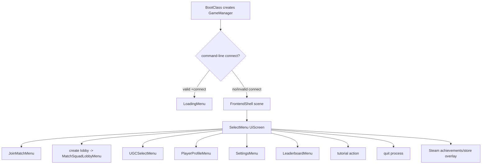

# Retail frontend UI map

## Scope and evidence

This note characterizes the retail-compatible boot shell and the first
`SelectMenu` screen. It does not attempt to recover every settings, lobby,
server-browser, or in-game screen.

The active revival bundle contains readable patched sources for the boot and
first screen, but still ships several original modules only as Python 2.7
bytecode. Source-line references for those bytecode-only modules use the full
decompile mirror. The embedded module names in that mirror match the modules in
the bundle.

| Evidence kind | Path |
| --- | --- |
| Active boot and patched frontend | `G:\AoSRevival\aos-nonsteam\src\aoslib\run.py`, `...\scenes\frontend\menuScene.py`, `...\selectMenu.py` |
| Original bytecode in active bundle | `G:\AoSRevival\aos-nonsteam\src\aoslib\gui.pyc`, `...\scenes\__init__.pyc`, `...\frontend\panelBase.pyc`, `...\tabBase.pyc`, `...\listPanelBase.pyc` |
| Line-addressable retail decompile | `G:\AoSRevival\aceofspades_decompiled\aoslib\gui.py`, `...\scenes\__init__.py`, `...\frontend\panelBase.py`, `...\tabBase.py`, `...\listPanelBase.py` |
| Imported immutable assets | `G:\AoSRevival\BattleSpadesClient\assets\original` |

The active `selectMenu.py` is not pristine retail code. In particular, the
tutorial action and service-availability handling have revival patches. The
visual layout and widget construction remain aligned with the retail
decompile; action differences are called out below.

## Boot to first screen



- `BootClass` creates `GameManager`, preloads favourites, and schedules
  `main()` at the next clock turn
  (`G:\AoSRevival\aos-nonsteam\src\aoslib\run.py:408-440`).
- With no usable `+connect_lobby` or `+connect`, boot chooses the frontend
  shell with `manager.set_scene(MenuScene)`
  (`G:\AoSRevival\aos-nonsteam\src\aoslib\run.py:358-405`).
- The shell's `on_start()` defaults its child to `SelectMenu`
  (`G:\AoSRevival\aos-nonsteam\src\aoslib\scenes\frontend\menuScene.py:42-48`).
- `SelectMenu.on_start()` enables the appropriate actions and starts
  `music/mainmenu.ogg` if it is not already playing
  (`G:\AoSRevival\aos-nonsteam\src\aoslib\scenes\frontend\selectMenu.py:115-118`).

### The two `MenuScene` classes

The Python names conceal two different responsibilities:

1. `aoslib.scenes.MenuScene` is a leaf-screen marker. It derives from
   `ElementScene` and only establishes `control = True`
   (`G:\AoSRevival\aceofspades_decompiled\aoslib\scenes\__init__.py:65-154`).
   `SelectMenu`, panels, and tabs derive from this type.
2. `aoslib.scenes.frontend.menuScene.MenuScene` is the outer shell/router. It
   owns the background, active/previous child screen, transition, coordinate
   transform, and scene/game blending
   (`G:\AoSRevival\aos-nonsteam\src\aoslib\scenes\frontend\menuScene.py:16-40`).

The native client should call these `FrontendShell` and `UiScreen`; reproducing
the duplicate name would create needless ambiguity.

## Frontend shell behavior

### Screen lifecycle and routing

`FrontendShell.set_menu()` performs the following ordered transition
(`menuScene.py:63-86`):

1. Clear prior hover by sending the old screen an off-screen mouse position.
2. Set slide direction: `current_x = +1` for forward and `-1` for `back=True`.
3. Save the old screen, call its `on_stop()`, then reuse or construct the new
   screen from a class-keyed cache.
4. Set `parent`, set `in_game_menu`, and call the new screen's `on_start()`.
5. Send the new screen an off-screen mouse position and select cursor capture
   from its `control` flag.

This means `initialize()` is effectively one-time construction, while
`on_start()` and `on_stop()` are re-entry hooks. The C++ router needs the same
observable lifecycle, but not Python's `gc.collect()` call or class-object
lookup.

The transition converges `current_x` toward zero with divisor 10, retains the
old screen until `abs(current_x) < 0.005`, and accepts child-screen input only
while `abs(current_x) < 0.5` (`menuScene.py:88-102`, `150-160`). Forward
navigation brings the new screen from the right and draws the old screen one
window-width left; `back=True` reverses those sides (`menuScene.py:134-145`).

### Coordinate and draw contract

- Widget geometry is authored on an 800 by 600, bottom-left-origin canvas;
  the constants are explicit in
  `G:\AoSRevival\aceofspades_decompiled\shared\hud_constants.py:18-19`.
- The full-screen background uses an aspect-preserving cover calculation
  (`G:\AoSRevival\aceofspades_decompiled\aoslib\__init__.py:8-37`).
- Child UI uses `manager.get_aspect(800, 600)`, then translation and a uniform
  scale. The inverse mouse transform subtracts the canvas offset and divides
  by that ratio (`menuScene.py:131-168`).
- Draw order is: clear, optional gameplay scene, fading background, previous
  child, current child, then child HUD (`menuScene.py:110-148`).
- A control screen makes the OS cursor visible by disabling exclusive mouse;
  a non-control HUD may pass input through to the game scene
  (`menuScene.py:84-86`, `153-160`).

### Native `get_aspect` confirmation

The compiled implementation was checked headlessly in
`G:\AoSRevival\aos-nonsteam\src\aoslib\gamemanager.pyd` (SHA-256
`a56d0b2ab313a550e4a7430365f8265d073748d71a4e8b47b8828a6903d4654c`).
The Python wrapper is at `0x1002D330` and the implementation at `0x10011F20`.
The latter was annotated in the companion IDA database as
`GameManager_get_aspect_impl`.

The recovered calculation is:

```text
ratio = min(window_width / requested_width,
            window_height / requested_height)
scaled_width = ratio * requested_width
scaled_height = ratio * requested_height
x = int((window_width - scaled_width) / 2)
y = int((window_height - scaled_height) / 2)
return (x, y, int(scaled_width), int(scaled_height), ratio)
```

This confirms an aspect-preserving contained viewport with centered letterbox
or pillarbox bars. The native `DesignCanvas` behavior is based on this binary
evidence rather than an inferred widescreen policy.

## Select menu layout

Main-menu constants are 262 by 58 text buttons, 30 nominal font size, 37
bottom margin, 5 inter-button spacing, and 16 group spacing
(`G:\AoSRevival\aceofspades_decompiled\shared\hud_constants.py:38-43`).
`SelectMenu.initialize()` constructs its controls at
`G:\AoSRevival\aos-nonsteam\src\aoslib\scenes\frontend\selectMenu.py:22-112`.

All coordinates below are in the 800 by 600 design canvas. A `TextButton`'s
`y` is its top edge; its hit rectangle extends downward by `height`.

| Control | Geometry | Localized label / icon | Action |
| --- | --- | --- | --- |
| Tutorial | center `(298.875, 123.125)`, size `63.75` | `icons/icon_tutorial.png` | tutorial session |
| Achievements | center `(366.625, 123.125)`, size `63.75` | `icons/icon_achievements.png` | platform overlay |
| Leaderboard | center `(434.375, 123.125)`, size `63.75` | `icons/icon_leaderboards.png` | `LeaderboardMenu` |
| Settings | center `(502.125, 123.125)`, size `63.75` | `icons/icon_options.png` | `SettingsMenu` |
| Map Creator | `(269, 232)`, `262 x 58` | `UGC_MAIN_MENU_UGC_BUTTON` | `UGCSelectMenu` |
| Player Profile | `(269, 295)`, `262 x 58` | `PLAYER_PROFILE` | `PlayerProfileMenu` |
| Create Match | `(269, 358)`, `262 x 58` | `CREATE_MATCH` | async lobby creation, then `MatchSquadLobbyMenu` |
| Join Match | `(269, 421)`, `262 x 58` | `JOIN_MATCH` | `JoinMatchMenu` |
| Quit | bar `(248, 32)`, `304 x 26`; centered content-sized target | `QUIT` + `quit_icon` | close window |

The frame is centered at `(400, 236)`, the logo is translated to `(412, 510)`
and scaled by `0.75`, and the player-name frame is placed dynamically at the
top-right of the visible design area (`selectMenu.py:179-219`). Conditional
demo/DLC purchase panels exist at the sides but should be a later slice.

The outgoing actions and their confirmation/buy cues are defined at
`selectMenu.py:221-327`. Destination screens conventionally return with
`parent.set_menu(SelectMenu, back=True)`; examples are the original
`joinMatchMenu.py:95-98`, `ugcSelectMenu.py:96-99`, and
`settingsMenu.py:191` in the decompile mirror.

### Current revival delta

- Retail `tutorial_pressed()` routed to `JoiningGameMenu` with tutorial server
  mode (`G:\AoSRevival\aceofspades_decompiled\aoslib\scenes\frontend\selectMenu.py:229-231`).
- The active revival client starts an isolated local BattleSpades tutorial host
  instead (`G:\AoSRevival\aos-nonsteam\src\aoslib\scenes\frontend\selectMenu.py:221-227`).
- The active availability logic at `selectMenu.py:120-161` is also patched.

The native screen should emit typed actions such as `StartTutorial`,
`OpenJoinMatch`, and `Quit`; application/session services decide how those
actions are fulfilled. This preserves current revival behavior without putting
networking or process management into widgets.

`MainTab` is not the main menu. It is the first tab of the settings screen,
containing volume, fullscreen, invert-mouse, and favourite-server rows
(`G:\AoSRevival\aos-nonsteam\src\aoslib\scenes\frontend\mainTab.py:21-55`).

## Widget and input model

### Hierarchy used by the first screen

```text
ControlBase
  HandlerBase                         callback list
    SquareButton                      four icon controls
    TextButton                        four large actions
    NavigationBar                     content-sized quit action

ControlBase
  Scene
    ElementScene                      forwards events to every child
      UiScreen (Python: aoslib.scenes.MenuScene, control=true)
        SelectMenu
      FrontendShell (Python: frontend.menuScene.MenuScene)
```

`ControlBase` supplies enabled/visible flags and no-op event methods;
`HandlerBase` stores callbacks and invokes them in insertion order
(`G:\AoSRevival\aceofspades_decompiled\aoslib\gui.py:30-82`). `ElementScene`
forwards mouse, keyboard, text, and scroll events to every element when the
scene is enabled; there is no capture or event-consumed return value
(`G:\AoSRevival\aceofspades_decompiled\aoslib\scenes\__init__.py:65-131`).

### Exact pointer behavior

- `TextButton` hit bounds are `[x, x + width]` and
  `[y - height, y]`. Motion/drag updates hover. Press sets `pressed` whenever
  enabled and visible; release recomputes hover and fires only when still
  pressed and inside (`G:\AoSRevival\aceofspades_decompiled\aoslib\gui.py:615-639`).
- `SquareButton` uses center/size bounds and the same release-inside rule
  (`gui.py:147-171`).
- Neither button class filters the mouse button or requires hover at press at
  this layer. Therefore drag-in activation and non-left activation are implied
  by the recovered Python unless the native `GameManager` filters upstream.
  Capture this dynamically before making it a permanent Classic invariant.
- `NavigationBar` is different: it records a press only in the currently
  hovered left/middle/right content region and emits `NAVBAR_LEFT = 1`,
  `NAVBAR_MIDDLE = 0`, or `NAVBAR_RIGHT = 2` on matching release
  (`gui.py:801-909`). Its hit regions are based on rendered text and icon width,
  not the entire bar.
- Initial `SelectMenu` has no recovered key handler, focus index, or selected
  button. Its three widget types also have no keyboard activation method.
  Retail evidence therefore establishes a pointer-first screen, not keyboard
  or controller navigation. Accessible focus navigation is a useful native
  enhancement, but must not be described as retail parity without dynamic
  evidence.

Button state is `normal`, `hovered`, `pressed`, or `disabled`; there is no
focused state on this screen. `TextButton` composes left/middle/right slices,
stretches the middle, darkens disabled buttons to 70%, and moves pressed
content downward (`gui.py:677-748`). `SquareButton` swaps complete normal,
hover, and press images and applies `BUTTON_DISABLED_COLOUR = (86, 86, 86,
255)` (`gui.py:173-205`; `hud_constants.py:57`). Click sounds belong to screen
callbacks, not the widgets.

## Assets, text, and localization

`pyglet.resource.path` is rooted at `png/ui`, and importing `aoslib.images`
loads the global UI set (`G:\AoSRevival\aos-nonsteam\src\aoslib\run.py:169-172`,
`338`; `...\aoslib\images.py:913-927`). Main-menu mappings are explicit at
`images.py:147-181`, `239-243`, and `428-431`.

The following required files were verified in the new asset tree:

- `assets/original/png/ui/ugc_splash.png` and `splash.png`;
- `assets/original/png/ui/main_menu/frame_main_menu.png` and
  `frame_player_name.png`;
- `assets/original/png/ui/common_elements/buttons/button_large_{left,mid,right}.png`
  plus hover/press variants;
- `assets/original/png/ui/common_elements/buttons/mm_button_square_{default,hover,press}.png`;
- the four `assets/original/png/ui/icons/icon_*.png` files listed in the layout;
- `assets/original/png/ui/common_elements/nav_bar/quit_icon.png`;
- `assets/original/sounds/menu_confirmA.ogg`, `menu_backA.ogg`,
  `menu_buyA.ogg`, `menu_scrollA.ogg`, and `assets/original/music/mainmenu.ogg`;
- `assets/original/fonts/A750-Sans-Medium.ttf`, `Spades.ttf`, `Edo.ttf`,
  `Tuffy_Bold.ttf`, `Gen_Shin_Gothic_Monospace_Bold.ttf`, and
  `NotoSansJP-SemiBold.ttf`.

The localization loader selects `+language` or the platform language, supports
11 language IDs, imports that language module into the string namespace, and
falls back to English when import fails
(`G:\AoSRevival\aos-nonsteam\src\aoslib\strings\__init__.py:3-55`). Missing
string-ID lookup returns either a diagnostic or the ID itself
(`strings\__init__.py:61-68`). Russian and Polish select Spades/Tuffy, Turkish
selects Edo/Tuffy, and Japanese selects the retail Gen Shin/Noto JP fonts before font objects are
built (`strings\__init__.py:36-48`).

For this screen, default body text is A750 Sans, buttons use Spades, welcome
text is 16 px, navigation text is 24 px, and the large button fitting font
starts at 36 px (`G:\AoSRevival\aos-nonsteam\src\aoslib\text.py:250-291`,
`332-336`). `TextButton.set_text()` word-wraps into its padded bounds and
decrements the font size until all lines fit (`gui.py:537-579`;
`text.py:395-421`). That fitting behavior is required for translated labels;
hard-coded English widths are not sufficient.

## Adequate first native milestone

Do not begin with every retail widget. The smallest useful vertical slice is:

1. `UiCanvasTransform` for the 800 by 600 canvas, including inverse pointer
   mapping at 4:3, 16:9, and ultrawide resolutions.
2. Renderer-neutral `UiElement`, callback/action signal, `TextButton`,
   `SquareButton`, and `NavigationBar` state machines.
3. `FrontendShell` routing, cached screen lifecycle, forward/back slide, and
   transition-time input gate.
4. FreeType/HarfBuzz text fitting and stable asset IDs for the exact Select
   Menu resources above.
5. A data-authored `SelectScreen` that emits typed actions. Unimplemented
   destinations may show an explicit placeholder; widgets must not launch a
   server or call network/platform APIs directly.
6. Classic golden screenshots at 800x600 and 1280x720, pointer-boundary tests,
   drag/release tests, English plus one long translation and Japanese font
   tests, and confirmation/quit audio-cue tests.

That milestone exercises platform input, bgfx UI rendering, asset resolution,
text shaping, audio, and frontend routing while remaining independent of VXL
rendering and the network protocol.
